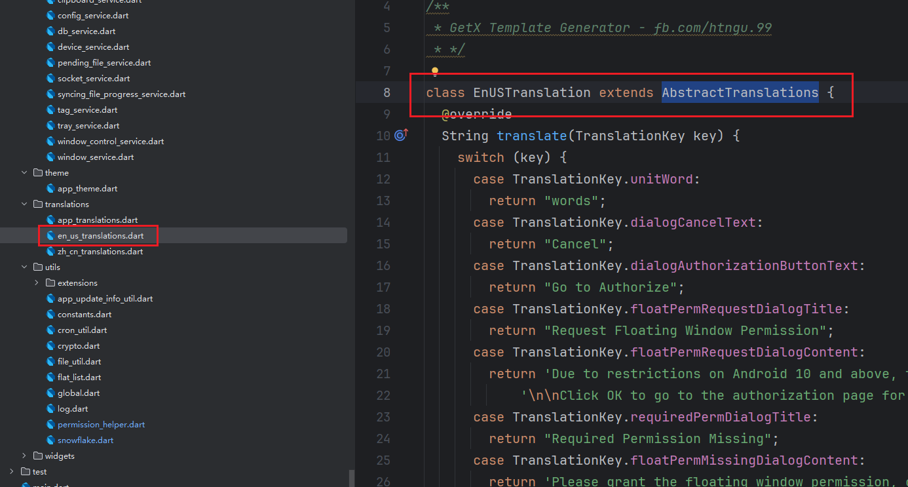
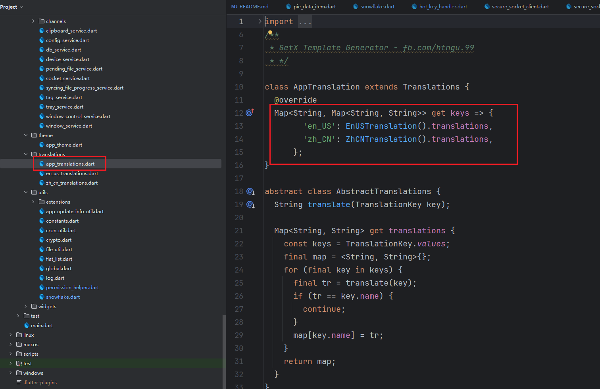

## ClipShare

官网：[ClipShare](https://clipshare.coclyun.top/)

该项目源于我想找一个 Android 平台上的剪贴板同步工具，但是基本上在 Andorid10+ 系统上都无法后台无感同步和公网环境下同步（本人是个懒人）于是决定自己来实现，目标是全平台，但是由于个人精力有限，当前主要还是在Android和Windows平台上，Linux平台也快了（没做测试）。

其中公网方案是通过一个中转程序进行数据转发（不会保留任何数据），中转程序暂时还未开源。

主要是基于Flutter + 平台原生混合开发，Android上的剪贴板监听方案有两种：

+ 系统日志，这个大多数系统都支持，但是在OriginOS系统上无效，因为没有相关日志输出
+ 系统隐藏API，通过在 shell / root 进程下反射调用系统隐藏api实现，但是同样在某些手机（如小米）上可能无效，当然，这个可能是因为 api 有变化，部分系统暂时可能还不支持。

> 先叠个甲，Flutter 和 Dart 我也是第一次用，可能写的不好

请在dev分支上开发和提交！⚠
请在dev分支上开发和提交！⚠
请在dev分支上开发和提交！⚠

### 1. 支持平台

> 项目中有对应的代码是为了后续增加支持，不代表现在支持

+ [x] Android
+ [x] Windows
+ [ ] Linux(快了，等待测试)
+ [ ] Mac
+ [ ] IOS

## 2. 项目结构

本项目是主体，为了解耦和给其他项目使用，核心的剪贴板监听逻辑单独抽离出来为插件了，项目地址：[Flutter-ClipboardListener-ClipShare](https://github.com/aa2013/ClipboardListener)

主要使用的 GetX 框架

### 2.1 项目结构

```
lib/
├── app/
│ ├── data/                  # 数据相关的类
│ │ ├── chart/         	# 统计图表相关类
│ │ ├── enums/ 		 # 程序里面的几乎所有的枚举（历史原因可能还有没有迁移进来的）
│ │ └── repository/	# 仓储类，数据库相关的都在里面
│ │ 	├── dao/			# dao类，CRUD接口
│ │ 	├── db/			  # 数据库部分的主类在里面
│ │ 	└── entity/		# 数据库实体类
│ ├── exceptions/	  # 程序相关的自定义异常
│ ├── handlers/		  # 程序内的一些处理器（感觉命名不太好，但是先这样吧）
│ │ ├── guide/			# 首次打开引用的用户引导相关
│ │ ├── socket/		  # 网络通信相关，程序内使用的基本上都是纯tcp连接，基于dart原生socket进行了一些封装
│ │ └── sync/			 # 数据同步相关处理器
│ ├── listeners/		 # 一些监听器
│ ├── modules/        # 所有的页面模块，里面还有个 views文件夹，存放一些页面（但又不是作为widget）
│ ├── routes/			# 所有的页面路由
│ ├── services/         # 一些全局服务
│ ├── theme/            # 应用主题配置
│ ├── translations/  # i18n 国际化翻译文件
│ └── utils/                # 一些工具类
│ │ ├── extensions/ # 一些扩展方法  
│ └── widgets/		  # 一些 Flutter 组件 
```

### 2.2 其他的

然后在对一些重点模块的代码文件进行简单解释：

#### 2.2.1 services 模块


#### 2.2 i18n 国际化模块

i18n 的所有翻译都通过 enums 枚举模块中的 TranslationKey 枚举中定义

然后在 translations 模块中 新建一个 xxx_translations.dart文件，里面继承 AbstractTranslations 类，然后实现对所有翻译枚举的内容返回：



然后在 app_translations 中添加你的新的翻译内容：


